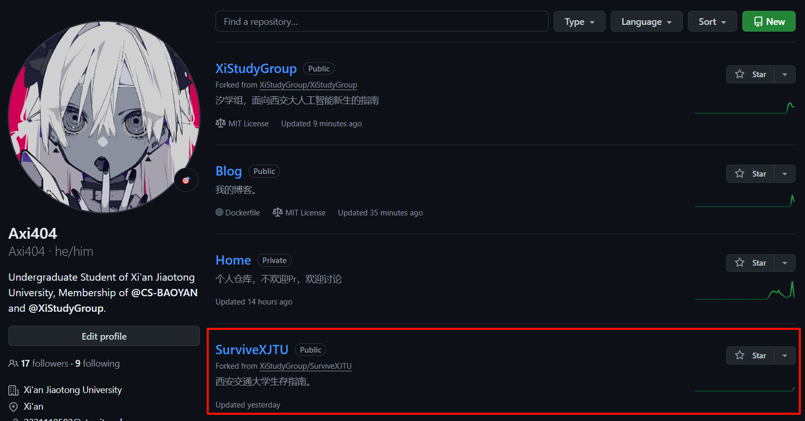
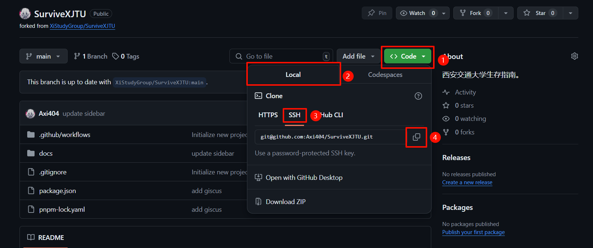
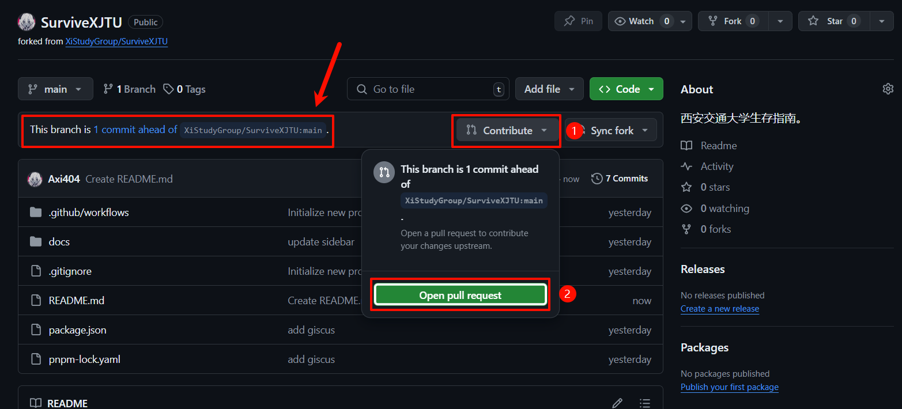
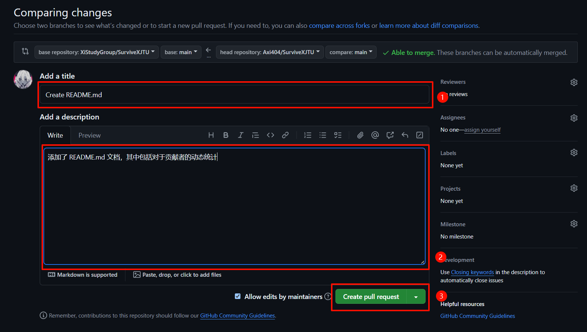

# 贡献指南

## 前言

贡献指南是关于 SurviveXJTU 相关内容的贡献指南，其中指引不同技术水平的撰写者完成对于 SurviveXJTU 内容的贡献。

## 致非 CS（**C**omputer **S**cience） 专业贡献者

对于非 CS 专业贡献者来说，使用包括 VSCode 进行文档的编辑操作，使用 Markdown 语言进行文档的书写，使用 Git 以及 Github 进行多人协作并且更新网页，这些内容可能过于的复杂。受限于专业讲述知识的限制，要求非 CS 专业的贡献者学习并掌握这些技能是一种苛责，并且会增加投稿的复杂性以及时间成本。

但是西安交通大学中大量的专业均不与 CS 专业产生直接的联系，这些领域中大量的学生与读者中存在着大量的信息值得分享，而为了维护这些知识，仓库的维护者为此付出时间是值得的。因此，欢迎此类型的贡献者使用邮箱投稿的方式对本教程进行投稿，其中需要包含以下的内容：

- 邮件标题：SurviveXJTU 投稿+投稿内容
- 邮件正文：作者署名（可为真名或昵称，若无则为匿名），投稿内容所在板块，以及推荐的位置（例如在某一文章之后，某两篇文章之间等），正文内容可留空，则由仓库维护者自行决定，并将文章作者标名为匿名贡献者。
- 邮件附件：压缩包，教程文件，请无论是否仅含有一个文件，均使用压缩包，其中包含以下内容：
  - **文档正文**：使用 word（`.doc`/`.docx`）或者 Markdown（`.md`）进行撰写。
  - **images 文件夹**：包含所使用的全部插图的源文件，静态图片请使用 `.jpg`/`.png` 格式，动态图片请使用 `.gif` 格式。若无插图，则无需此文件夹。对于视频的插入等内容请给出链接，维护者会仔细研究并手动维护，无需放入 images 文件夹。

将邮件发送至 `2221110582@stu.xjtu.edu.cn`，维护者收到投稿后会基于人工的回信，请在收到 `完成投稿` 通知前保证发件邮箱的经常查阅，以便维护者与贡献者进行沟通。

## 致 CS 专业贡献者

对于 CS 专业的贡献者，在为本教程进行贡献的过程中所使用的绝大多数技能均为 CS 领域的常见技能，在这里笔者推荐 CS 专业的贡献者使用 CS 领域的常规贡献途径进行贡献，这是被鼓励的，并且也是提高相关技能熟练度的很好的练手场所。同时，使用非 CS 专业贡献者的投稿通道也是被允许的，一切的投稿均是受到欢迎的。

本部分将讲解详细的 CS 专业贡献者的贡献流程，其中包括的前置技能有 <u>Git 的使用</u>以及 <u>Markdown 的撰写</u>。相关技能的初步了解可以前往 [廖雪峰的 Git 教程](https://www.liaoxuefeng.com/wiki/896043488029600) 以及 [Markdown 官方教程](https://markdown.com.cn/basic-syntax/) 进行学习。

### 注册 Github 账号

作为贡献者，首先需要注册 Github 账号，这一步十分的简单，前往 [Github 官网](https://github.com/) 并点击 `Sign Up`，根据要求进行注册即可，在这里并不进行过多的讲解。

### 初始化本地 Git 并配置 SSH

在 [Git 官网](https://git-scm.com/) 选择下载 Windows 版本并按照提示进行安装。


在安装中需要注意的是：

- 在 `Select Components` 中选择 `Git LFS`，按需求安装其他组件。
- 在 `Adjusting the name of the initial branch in new repositories` 中可以选择 `Override the default branch name for new repositories` 并将主分支命名为 `main`（貌似是因为原默认名称 `master` 涉及种族歧视，如今 Github 默认分支为 `main`，最好保持一致）。
- 在 `Adjusting your PATH environment` 中选择 `Recommended` 的选项。
- 其他内容选择默认选项即可，或者在互联网进行查询。

安装之后首先设置 Git 的基本信息：

```shell
git config --global user.name "Your Name"
git config --global user.email "Your Email"
```

之后需要配置 SSH，首先需要检查是否已经存在 SSH 密钥，如果存在则跳过此步骤，否则需要进行创建：

```shell
ssh-keygen -t ed25519 -C "Your Email"
# 或者使用 ssh-keygen -t rsa -C "Your Email"
cat ~/.ssh/id_ed25519.pub
# cat ~/.ssh/id_rsa.pub
```

将生成的密钥复制到 Github 中的 `Settings` 中的 `SSH and GPG keys` 中的 `New SSH key` 并粘贴。

此时本地理论上已经可以进行 Git 的 push 等操作到远程储存库了。

### Fork 本仓库

进入本仓库的 [Github 主页](https://github.com/SurviveXJTU/SurviveXJTU.github.io)，点击 `Fork` 按钮，即可将本仓库 Fork 到自己的 Github 账号下。


Fork 操作本质上是复制了一份本仓库到自己的账号下，并在自己的账号下享有修改的权限，同时可以比较自己账号下的仓库与上游仓库之间的更改差别，Fork后的仓库可以在自己账号的 Repositories 中看到。



### 克隆仓库

在 Fork 完成之后，在自己 Fork 的仓库中，找到并点击 `< > Code` 按钮，之后点击 `SSH` 按钮，并复制链接。



在本地找到适合保存本项目的文件夹，右键资源管理器，点击 `在终端中打开`，并进行克隆操作。

```shell
git clone your_ssh
```

### 仓库文件结构

在克隆完成之后，可以使用 [VSCode](https://code.visualstudio.com/) 等编辑器打开文件夹并进行编辑，其中首先需要了解的是文件的结构：

```txt
├───.github
├───docs
│   ├───.vitepress
│   │   ├───cache
│   │   └───theme
│   ├───images
│   ├───public
│   ├───folders
│   └───index.md
├───node_modules
├───.gitignore
├───package.json
├───pnpm-lock.yaml
└───tsconfig.json
```

其中例如 `.gitignore`, `package.json`, `pnpm-lock.yaml`, `tsconfig.json` 均为 Git 以及 Node.js 的相关配置文件，无需过于调整。`docs` 文档中包含 `.vitepress` 内容，此为 VitePress 的配置文件所在的文件夹，而其他的文件夹则按照文档的组织进行排序，其中本项目中全部的图片均维护在 images 文件夹中，而 logo 等资源则维护在 public 文件夹中。

### 撰写文档

在了解了文件结构之后便可以开始撰写文档了，确认自己想要撰写的文档所隶属于的类别，并进入该文件夹，新建一个 Markdown 文档，按照 Markdown 文档的语法进行撰写。

与此同时值得注意的是，VitePress 支持部分的 Markdown 拓展语法，这些内容可以在 [官方文档](https://vitepress.dev/zh/guide/markdown) 中查阅。

撰写文档之后进行保存即可。在这里需要注明的是，在 VitePress 中使用图片的插入，所使用的相对路径是相对于 Markdown 文档本身的相对路径，而非相对于项目根目录的相对路径。

### 修改 Sidebar

`SurviveXJTU` 的侧边栏使用人为的创建形式，这是为了更大限度的排版布局自由度，有的时候不同章节之间的内容，在写作的过程中存在顺序之分，而使用如 `vitepress-sidebar` 等插件自动生成 `Sidebar` 虽然快捷，但是很可能导致内容按照如字典序等方式进行排序，从而无法更好的符合写作者的意愿。

前往 `docs/.vitepress/config.mts` 中，可以在找到如下文所示内容，以下以其中的人生篇为例：

```ts
export default defineConfig({
    ...
    themeConfig:{
        sidebar: [
            {
                text: '人生篇',
                link: '/人生篇/',
                collapsed: true,
                items: [ // [!code focus]
                    ... // [!code focus]
                    { text: '关于西交', link: '/人生篇/关于西交' }, // [!code focus]
                    { text: '开源精神', link: '/人生篇/开源精神' }, // [!code focus]
                ] // [!code focus]
            }
        ]
    }

})
```

在其中找到你想要插入的位置，VitePress 会根据 items 中的顺序来排列 Sidebar，例如贡献者创建了文档 `人生思考`，并认为在排版布局中应位于 `关于西交` 与 `开源精神` 之间，则加入一行即可：

```ts
export default defineConfig({
    ...
    themeConfig:{
        sidebar: [
            {
                text: '人生篇',
                link: '/人生篇/',
                collapsed: true,
                items: [ // [!code focus]
                    ... // [!code focus]
                    { text: '关于西交', link: '/人生篇/关于西交' }, // [!code focus]
                    { text: '人生思考', link: '/人生篇/人生思考'} // [!code ++] // [!code focus]
                    { text: '开源精神', link: '/人生篇/开源精神' }, // [!code focus]
                ] // [!code focus]
            }
        ]
    }

})
```

### 提交更改

在完成了文档的修改之后，可以使用 Git 进行更改的提交：

```shell
git pull origin main
git add .
git commit -m "your commit message"
git push origin main
```

之后可以看到自己的更改已经提交到了自己的 Github 仓库中。

### 发起 Pull Request

假如说进行了成功的提交，可以注意到，自己的仓库中应显示如 `1 commit ahead of` 的字样。点击 `Contribute` 并点击 `Open pull request` 即可发起一个 Pull Request，并等待管理员进行审核。



请确保 PR 的 title 中表意明确，同时 description 中清晰描述了自己添加的内容，之后点击 `Create pull request` 即可，管理员在收到内容之后会进行审查并给出 `comment` 或直接将你的 PR Merge 进主分支，即完成了贡献。



### 完成贡献

进行了上述的内容，便成功完成了一次贡献，你的内容将保留在 SurviveXJTU 中，并为后来者指引方向。

## 致全体贡献者

感谢每一位贡献者的辛勤贡献，无论是使用邮件方式进行投稿，还是使用 Git 工作流，你们均无私地将信息进行了开源分享，这有助于未来的每一位新生更好的认识交大，更好的提升自我，向你们每一位致以最诚挚的感谢。

## Acknowledgements

特别感谢 [VitePress](https://vitepress.dev/zh/), [Nólëbase 集成](https://nolebase-integrations.ayaka.io/pages/zh-CN/) 以及 [VitePress 快速上手中文教程](https://vitepress.yiov.top/) 等开源项目与教程，SurviveXJTU 的诞生离不开这些开源项目的支持。